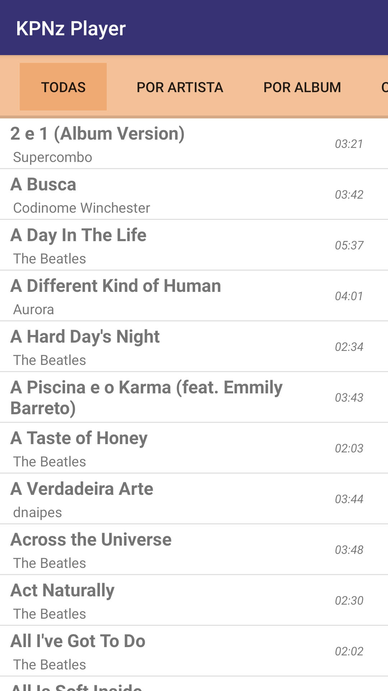
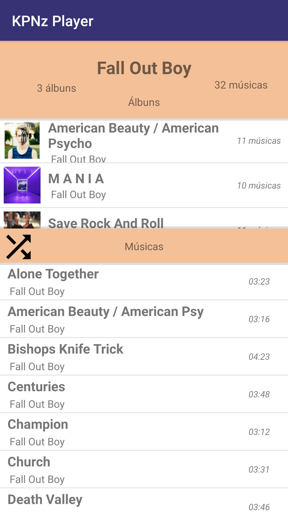

##  **Android Music Player**
*Project created with the intention of learning about Android programming.*

*Author: Lucas Gabriel - UFCG Computer Science Studant 2019.1*

**Things to do:**
 - Learn about MediaSession.
 - Know how to dismiss notification when paused.
 - Do a better design.
 - Create new tab to Podcasts downloaded at device.
 - Make the album Picture be rounded.
 - Add queue controller
 - Use fragments to switch between tabs.

**ScreensShots:**
Begin of app and album activity:

 

All Albuns list and artist activity:

 

Notification:

