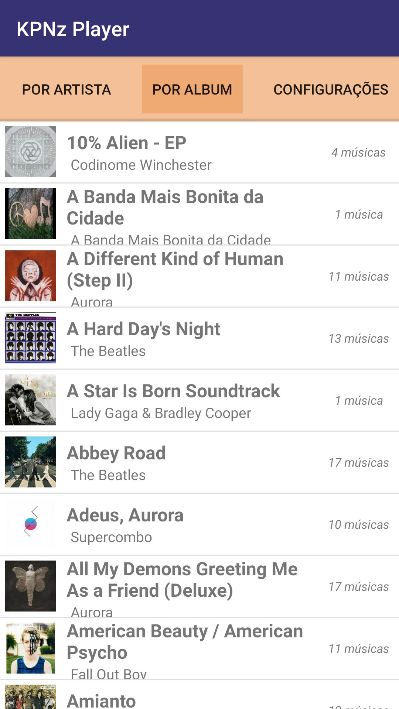
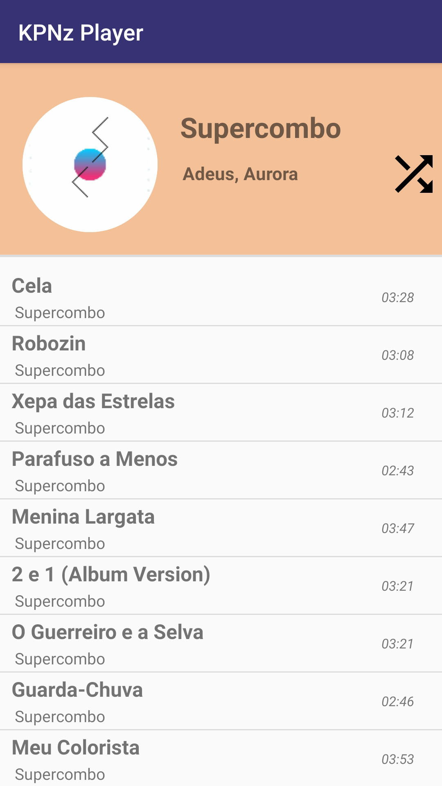

##  **Android Music Player**
*Project created with the intention of learning about Android programming.*

*Author: Lucas Gabriel - UFCG Computer Science Studant 2019.1*

**Things to do:**
 - Learn about MediaSession.
 - Do a better design.
 - Add queue controller
 - Use fragments to switch between tabs.
 - Create new tab to Podcasts downloaded at device. *DISCONTINUED*
 - Know how to dismiss notification when paused. *DONE*
 - Make the album Picture be rounded. *DONE*
 - Find a better way to organize musics in album and artists. *DONE*

**ScreensShots:**
MainActivity with all songs and all albuns list:

 

AlbumActivity and ArtistActivity:

 

Notification:

*If you want to test, you can download the alpha in the "./apk" directory.*

**Version: 1.0.0**
